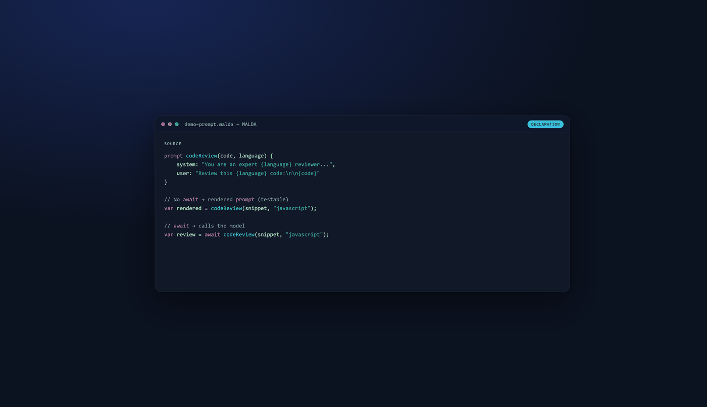
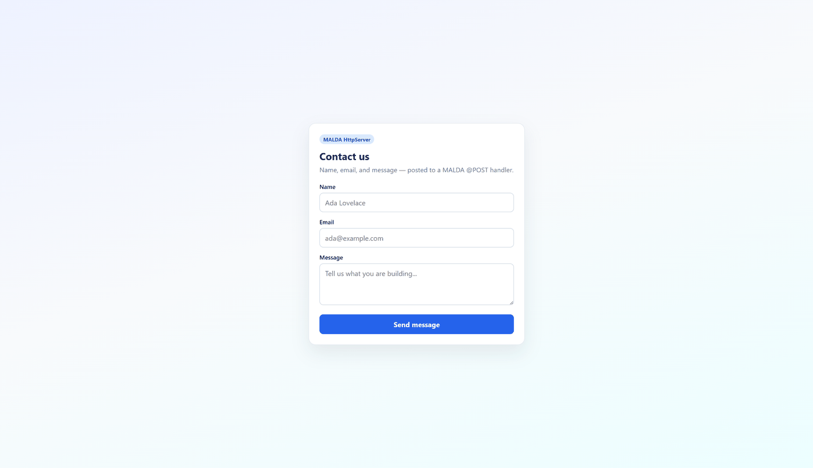

# MALDA™

**MALDA** (Multi Agent Language with Development Automation) is an AI-native programming language and platform for agents, web apps, and durable workflows. The automation in the name runs both ways: coding agents write MALDA — the language pack in [`docs/llm/`](docs/llm/) exists for that reader — and MALDA programs automate development work in turn.

This repository is the **open-source core**: language runtime, compiler/transpiler, IDEs, language server, examples, templates, and reference manual.

## MALDA in one file

Verbatim from [`Examples/Basics/first_look.malda`](Examples/Basics/first_look.malda). No API key. `-> Review` binds the prompt to the schema. Without `await`, the call is a rendered template; `await` would call the model and validate the JSON against `Review`. `validate("Review", …)` is that same check, shown offline (type annotations elsewhere are IDE/LSP hints, not runtime checks).

```malda
schema Review {
    summary: string;
    issues: string[];
}

prompt codeReview(code, language) -> Review {
    system: "You are an expert reviewer of {language}.",
    user: "Review this {language} code:\n\n{code}"
}

var rendered = codeReview("function add(a, b) { return a + b; }", "javascript");
io.print(rendered.user);

var checked = validate("Review", {
    "summary": "Looks fine",
    "issues": []
});
if (checked.ok) {
    io.print("schema ok: " + checked.data.summary);
} else {
    io.print("schema failed: " + checked.error);
}
```

```bash
malda Examples/Basics/first_look.malda
```



*`prompt` is syntax: without `await` you get the rendered prompt; with `await` you call the model.*



*Contact form on `HttpServer`: fill fields, `@POST /submit`, thank-you page (`Examples/ui_contact_form.malda` pattern).*

## Features

- **Language & runtime** — objects, functions, actors, exceptions, namespaced standard library (`io` / `math` / `str`)
- **Three backends, documented overlap** — interpret for iteration; transpile to a .NET executable; compile a **browser subset** to JavaScript (no agents, HTTP servers, or workflows on the JS path). Matrix: [`docs/spec/backend-capability-matrix.md`](docs/spec/backend-capability-matrix.md)
- **AI** — `prompt` declarations, agents, tools, MCP
- **Web** — REST decorators and `@PAGE` / `@AIPAGE` on the host runtime
- **Workflows** — durable `step` / retry / compensate on local SQLite (single writer, not a cluster)
- **Types** — annotations feed the IDE/LSP (mismatches are Errors by default in the editor); runtime stays dynamic. `malda compile --mode transpile` / `publish` refuses emit on those Errors (`--lenient-types` to skip)
- **Tooling** — Desktop IDE (Windows reference), Web IDE (browser playground — not Desktop parity), VS Code + LSP

**What this is not:** a Temporal cluster, a full static type system, or three equal backends. Workflows are local SQLite (single writer). JavaScript is a browser subset. Spec Final 1.0 is the language kernel; the toolchain is **1.0.2** (publish is the type boundary).

The two largest showcases were written entirely by coding agents, even though MALDA is in no
model's training data, because [`docs/llm/`](docs/llm/) ships a compact language pack for that
reader: **`Examples/Agents/secondbrain_semantic.malda`** (~7,600 lines with shared libs) and
**`Examples/RalphWiggum/`** (4,049 lines). Guard tests, the conformance matrix, and executed
reference-manual snippets keep those claims checkable.

Longer version, with objections and current weaknesses stated up front:
[`docs/announcement.md`](docs/announcement.md).

## Requirements

- [.NET 8 SDK](https://dotnet.microsoft.com/download/dotnet/8.0) if you build from source
- Windows for Desktop IDE (WPF); CLI, Web IDE, and VS Code extension work cross-platform where .NET 8 does

## Install without cloning the sources

GitHub Releases ship **self-contained zips** (no separate .NET install needed):

1. Open [Releases](https://github.com/amaldini/maldalang/releases) and download
   `malda-<version>-win-x64.zip` or `malda-<version>-linux-x64.zip`.
2. Unzip, then:

```bash
# Windows — CLI
malda.bat Examples\Basics\first_look.malda
# or: bin\malda\malda.exe Examples\Basics\first_look.malda

# Windows — Desktop IDE (included in the win-x64 zip)
MaldaDesktop.bat

# Linux — CLI only (no WPF Desktop IDE)
./malda Examples/Basics/first_look.malda
```

The archive also includes `Examples/`, the HTML `ReferenceManual/`, `Templates/`
(for `malda new`), the language pack under `docs/llm/`, `docs/spec/`, and dual-licence
files. Point coding agents at `AGENTS.md` (then `docs/llm/`) so they can write `.malda`
programs without the git sources. Optional: add `bin/malda` to your `PATH`.

To rebuild those zips locally:

```bash
# Windows (CLI + Desktop IDE)
build_malda_distribution.bat
# or: powershell -File scripts/build-oss-dist.ps1 -Runtime all
```

Tagged releases (`v*`) build the zips in CI via `.github/workflows/release.yml`.

## Quick start (from source)

```bash
git clone https://github.com/amaldini/maldalang.git
cd maldalang
dotnet build MaldaLang.sln
dotnet run --project MaldaLang -- Examples/Basics/first_look.malda
```

On **Linux and macOS**, build the projects instead of the solution — `MaldaLang.sln`
includes the WPF Desktop IDE, which targets `net8.0-windows` and cannot build elsewhere:

```bash
dotnet build MaldaLang
dotnet build MaldaLang.Compiler
dotnet build MaldaLang.LanguageServer
dotnet build MaldaLang.IDE
dotnet run --project MaldaLang -- Examples/Basics/first_look.malda
```

Or build a reusable CLI output:

```bash
dotnet build MaldaLang -o artifacts/malda-cli
# Windows: malda.exe — Linux/macOS: malda
artifacts/malda-cli/malda Examples/Basics/first_look.malda
```

Compile to an executable (one-liner smoke: `Examples/Basics/hello_world.malda`):

```bash
dotnet run --project MaldaLang -- compile Examples/Basics/first_look.malda --mode transpile -o first-look.exe
```

## LLM access (optional)

Core language examples such as `first_look.malda` and `hello_world.malda` need **no API key**
and make **no network calls**.

AI features (`prompt`, agents, `@AIPAGE`, and similar) use, in order:

1. **OpenRouter** when `OPENROUTER_API_KEY` is set (or `providers.openrouter.apiKey` in
   `~/.malda/config.json`).
2. Otherwise a **local GGUF fallback**: on first use MALDA downloads
   [`qwen2.5-0.5b-instruct-q4_k_m.gguf`](https://huggingface.co/Qwen/Qwen2.5-0.5B-Instruct-GGUF)
   (~500 MB) from Hugging Face into the local app-data cache
   (`%LOCALAPPDATA%\MaldaLang\Models\default` on Windows). That model proves the pipeline
   offline; it is not a production-quality chat model.

To prefetch the local model deliberately:

```bash
dotnet run --project MaldaLang -- onboard --download-local-llama
```

## IDEs and editors

These are **not** the same product surface:

| Tool | Role | Best for |
|------|------|----------|
| **Desktop IDE** (`MaldaLang.DesktopIDE`) | Full Windows IDE | Daily development: multi-file/`include`, virtual `@malda-section` tabs, local models, MCP, UIHost preview, richer compile |
| **Web IDE** (`MaldaLang.IDE`) | Browser learning playground | Try examples, edit/run/debug in Monaco from any OS — **not** feature-parity with Desktop |
| **VS Code + LSP** (`vscode-malda`, `MaldaLang.LanguageServer`) | Cross-platform editor integration | Serious editing outside the Desktop IDE |

```bash
# Web IDE (browser playground)
dotnet run --project MaldaLang.IDE
# then open the printed https://localhost:... URL

# Desktop IDE (Windows)
dotnet run --project MaldaLang.DesktopIDE
```

Community help on the Web IDE (Monaco UX, diagnostics, examples browser) is welcome; Desktop remains the reference IDE.

## Why MALDA exists

I have spent years writing business software in C#, Java and VB.NET — PDM/PLM systems, CAD
integrations, integrations with ERP and other business systems, data processing — work where
the hard part is the domain and getting existing systems to agree with each other, not
language internals. This is the first compiler or interpreter I have written. With coding
agents I now write far less code by hand, and a language is the project where what remains is
the deciding: an agent will type a parser, but someone still has to say what the grammar
means. Those decisions were not made alone either — the grammar and the semantics were argued
out with models, so the project ended up being its own subject: how you design a programming
language now that agents write most of the code. The push to try came from Geoff Huntley's
[Ralph Wiggum technique](https://ghuntley.com/ralph/) and the
[`cursed`](https://ghuntley.com/cursed/) language he built with it — hence the name of
`Examples/RalphWiggum/`. What I wanted was different from an esoteric language: one whose
subject is the work I spend my days around, so prompts, tools, agents, endpoints and durable
workflows are syntax instead of glue code. I am not running MALDA in that work today — my day
job is large systems already in flight, and those do not get rewritten for an experiment. For
now it is where I experiment with what building on AI looks like.

## Learn more

| Path | Purpose |
|------|---------|
| [`AGENTS.md`](AGENTS.md) | Map for humans and coding agents |
| [`docs/llm/`](docs/llm/) | Compact pack for writing `.malda` programs |
| [`docs/architecture.md`](docs/architecture.md) | Pipeline and project layout |
| [`docs/start-here.md`](docs/start-here.md) | Guided onboarding |
| [`llms.txt`](llms.txt) | Compact doc index for LLM tools |
| [`docs/releases/v1.0.0.md`](docs/releases/v1.0.0.md) | Toolchain 1.0.0 (publish is the type boundary) |
| [`docs/releases/v0.1.0.md`](docs/releases/v0.1.0.md) | Notes for the first public tag |
| [`docs/releases/v0.1.1.md`](docs/releases/v0.1.1.md) | Notes for `--embed-folder` and Second Brain |
| [`docs/releases/v0.1.2.md`](docs/releases/v0.1.2.md) | Semantic Second Brain, BGE-M3, `getProgramDirectory()` |
| [`docs/releases/v0.1.3.md`](docs/releases/v0.1.3.md) | GraphMemory read-only load from `embed:` |
| [`docs/releases/v0.1.4.md`](docs/releases/v0.1.4.md) | Second Brain ASK web UI, `markdownToHtml`, empty-brain chat |
| [`docs/releases/v0.1.5.md`](docs/releases/v0.1.5.md) | Portable ASK branding, menu PACK, `compileMALDA` embedFolder |
| [`docs/releases/v0.1.6.md`](docs/releases/v0.1.6.md) | Locale-safe float transpile, Spectre markup fallback, release version guard |
| [`docs/releases/v0.1.7.md`](docs/releases/v0.1.7.md) | Agent/CodingAgent transpile, optional Agent client, Second Brain compile |
| [`Examples/README.md`](Examples/README.md) | Full examples catalog (`requires`, tracks) |
| [`Examples/Basics`](Examples/Basics) | Language basics |
| [`Examples/Prompts`](Examples/Prompts) | Prompts and agents |
| [`Examples/Web`](Examples/Web) | REST, UI, auth, jobs |
| [`docs/tutorials/fullstack-sessions-auth.md`](docs/tutorials/fullstack-sessions-auth.md) | Sessions / CSRF / jobs walkthrough |
| [`Templates/`](Templates) | `malda new webapi` / `malda new fullstack` |
| [`ReferenceManual/`](ReferenceManual) | Language reference (HTML); [English](https://amaldini.github.io/maldalang/) · [Italiano](https://amaldini.github.io/maldalang/it/) |
| [`vscode-malda/`](vscode-malda) | VS Code extension |

## Solution layout

| Project | Role |
|---------|------|
| `MaldaLang` | CLI + interpreter (`malda`) |
| `MaldaLang.Compiler` | Transpiler / publish |
| `MaldaLang.IDE` | Web IDE (browser playground) |
| `MaldaLang.DesktopIDE` | Desktop IDE (full Windows IDE) |
| `MaldaLang.LanguageServer` | LSP |
| `MaldaLang.UIHost` | UI hosting support |
| `MaldaLang.Tests` | Automated tests |

## Scope of this repository

Included: core language, compiler, IDEs, LSP, examples, templates, conformance, docs, reference manual.

**Not included** (kept private or separate): product apps and vertical domain packs built on
top of MALDA. The open-source CLI zip is built from this repo
(`build_malda_distribution.bat`).

The compiler may keep string-only optional-pack emit hooks so separately distributed
assemblies can plug in without living in this repository.

## Contributing

See [CONTRIBUTING.md](CONTRIBUTING.md) and [AGENTS.md](AGENTS.md). Please do not run the full test suite locally by default; use filtered tests.

## Security

See [SECURITY.md](SECURITY.md).

## License

MALDA is dual licensed under either

- the [MIT License](LICENSE-MIT), or
- the [Apache License 2.0](LICENSE-APACHE),

at your option — the same arrangement Rust uses. Take whichever fits your project: MIT if you want the shortest possible terms or need GPLv2 compatibility, Apache-2.0 if you want an express patent grant. One choice covers the runtime, the compiler, the IDEs, the reference manual and the examples.

Programs you compile with MALDA are yours. The toolchain injects runtime code into its output, and [`LICENSE-RUNTIME-EXCEPTION`](LICENSE-RUNTIME-EXCEPTION) confirms that this creates no attribution obligation for your own program.

The name "MALDA" is not covered by either licence — see [TRADEMARK.md](TRADEMARK.md). Third-party dependencies are listed in [THIRD-PARTY-NOTICES.md](THIRD-PARTY-NOTICES.md).

## Maintainer

MALDA is maintained by Andrea Maldini ([@amaldini](https://github.com/amaldini)), a business-software developer for whom this is a first language project. There is no CLA and no plan to relicense: the core stays MIT OR Apache-2.0.

Everything goes through GitHub — [issues](https://github.com/amaldini/maldalang/issues) for bugs, questions and trademark requests, [discussions or a pull request](https://github.com/amaldini/maldalang/pulls) for design proposals, and private [Security Advisories](https://github.com/amaldini/maldalang/security/advisories) for vulnerabilities (see [SECURITY.md](SECURITY.md)).
