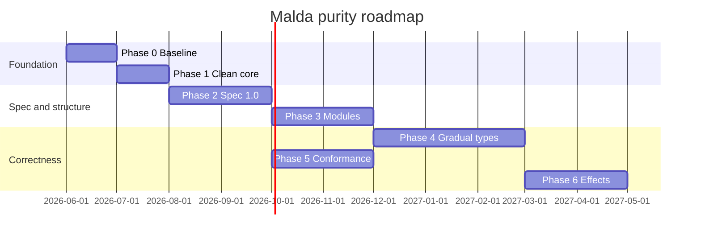

# Malda language purity & correctness roadmap

**Status:** Planning (2026-06-04)  
**Scope:** Make Malda Core small, predictable, and verifiable; keep AI/platform capabilities in versioned optional packs.  
**Horizon:** ~12–15 months for Tier 0 “enterprise-grade”; Phases 1–2 + 5 deliver ~80% of perceived maturity in ~4–5 months.

**Related plans**

- [core-builtin-inventory.txt](core-builtin-inventory.txt) — symbols in `BuiltInRegistry` (regenerate via `scripts/generate-core-builtin-inventory.ps1`)
- [newpotentialfeatures.md](newpotentialfeatures.md) — feature candidates
- [schema-to-llm-feature-plan.md](schema-to-llm-feature-plan.md) — Phase 6 overlap

**Source of truth (precedence)**

1. `MaldaLang/Parser/Parser.cs`, `MaldaLang/Interpreter/Interpreter.cs`, `MaldaLang.Compiler/CSharpTranspiler.cs`
2. `ReferenceManual/*.html`
3. `docs/spec/malda-language-1.0.md`, `README.md`
4. `Examples/*`

---

## Goals

| Goal | Outcome |
|------|---------|
| **Kernel purity** | Tier 0+1 runs without optional DLLs or domain globals |
| **Correctness** | One error model; optional `--strict-types` and exhaustiveness |
| **Verifiability** | Language spec 1.0 + conformance suite across interpreter / C# / JS |
| **Scalability** | Real modules (`export` / `import`), not only `include` chains |
| **Platform clarity** | AI, web, workflow = platform packs, not language semantics |

---

## Architecture tiers (target)

```
Tier 0 — Malda Core (stable, semver)
  Types, control flow, functions, classes, match, async/await, sum types,
  actors (syntax), include/using (interim), loadNativeModule hook

Tier 1 — Standard library (ships with core distribution)
  io, json, math, str, file, concurrency helpers (namespaced, not flat globals)

Tier 2 — Platform packs (optional, separate versioning)
  malda-ai, malda-web, malda-workflow, …
```

**Publish expectation**

| Command | Expectation |
|---------|-------------|
| `malda publish <app.malda> -o out/` | Core + Tier 1 only; single-file when possible |

---

## Guiding principles

1. **Small kernel** — few constructs, stable semver, no vertical domain in Tier 0.
2. **Layered correctness** — dynamic by default; strict mode opt-in.
3. **One error story** — `Result` + `match` for recoverable; exceptions for bugs.
4. **Measured parity** — same `.malda` tests on interpreter, transpile, JS (documented skips).
5. **Platform ≠ language** — richness lives in packs; the language stays teachable in one day.

---

## Completed: optional-pack isolation from core

**Verified 2026-06-04.** Vertical domain packs stay out of the OSS core registry and distribution. Remaining work is language/platform purity, not pack product docs.

| Check | Status |
|-------|--------|
| Optional-pack symbols not in `BuiltInRegistry` / `BuiltInFunctions` | Done |
| Legacy optional-pack shims removed | Done |
| Default `malda publish` does not require optional pack DLLs | Done |
| `loadNativeModule(...)` remains a generic core hook | By design |
| Compiler uses string-only optional-pack emit plugins | Done — [phase-1.1-pack-hardening.md](phase-1.1-pack-hardening.md) |

---

## Phase 0 — Baseline — **Complete** (2026-06-04)

**Objective:** Know current surface area and documentation drift.  
**Summary:** [phase-0-baseline-summary.md](phase-0-baseline-summary.md)

| Task | Output |
|------|--------|
| Builtin inventory | [x] [core-builtin-inventory.txt](core-builtin-inventory.txt) + [verify-core-builtin-inventory.ps1](../../scripts/verify-core-builtin-inventory.ps1) |
| Parser vs manual audit | [x] [parser-manual-drift-audit.md](parser-manual-drift-audit.md) |
| Optional packs status | [x] Moved out of core registry (2026-06-03) |
| Existing parity tests | [x] [tier0-construct-coverage.md](tier0-construct-coverage.md) |
| Pack regression guard | [x] [verify-optional-pack-registry.ps1](../../scripts/verify-optional-pack-registry.ps1) + `OptionalPackRegistryGuardTests` |
| Registry ↔ inventory CI | [x] `BuiltInRegistryInventoryTests` |
| Tier 0 conformance | [x] `MaldaLang.Tests/Conformance/Tier0/` (6 interpreter cases) |

**Definition of done** — all met.

**Dependencies:** None.

---

## Phase 1 — Clean core — **Complete** (2026-06-04)

**Objective:** Tier 0+1 builds and runs without vertical DLLs; tighten optional-pack boundaries.  
**Summary:** [phase-1-clean-core-summary.md](phase-1-clean-core-summary.md)

| # | Task | Notes |
|---|------|-------|
| 1.1 | Pack hardening | [x] [phase-1.1-pack-hardening.md](phase-1.1-pack-hardening.md) — auto-globals removed; compiler string-only emit |
| 1.2 | Namespace stdlib | [x] `math.*`, `str.*`, `io.*`; flat + `Math` aliases deprecated (IDE `malda-style`). See [phase-1.2-stdlib-namespaces.md](phase-1.2-stdlib-namespaces.md) |
| 1.3 | Syntax canon | [x] IDE warning on `fn`/`def` (`malda-style`); canonical `function` in docs |
| 1.4 | Manual alignment | [x] `typeOf`/`isNumber` (P0); chapter sync script + test; built-ins §12.2 namespaces + §12.24 pack table; appendix E — see [phase-1.4-manual-alignment.md](phase-1.4-manual-alignment.md) |

**Definition of done** — all met.

- [x] Default `malda publish` does not require optional pack DLLs
- [x] No optional-pack symbols in `BuiltInRegistry` — `verify-optional-pack-registry.ps1`, `OptionalPackRegistryGuardTests`
- [x] Core examples under `Examples/` run without optional pack DLLs — static scan + example guard tests
- [x] CI guard prevents re-adding optional-pack builtins to core registry (Phase 0 inventory tests)

**Interpreter fix (2026-06-04):** `async userFn()` restores caller environment after hot-start (`WrapCallAsTask` in `Interpreter.CallDispatcher.cs`). Concurrent `async` user calls that `sleep` before binding the next task variable remain a known limitation (use `await` between bindings or immediate-return callees in examples).

**Dependencies:** Phase 0.

**Next:** Phase 2.1 — [malda-language-1.0.md](../spec/malda-language-1.0.md).

---

## Phase 2 — Formal specification 1.0 — **Complete** (2026-06-04)

**Objective:** Versioned language contract.  
**Spec:** [docs/spec/malda-language-1.0.md](../spec/malda-language-1.0.md) (Draft 1.0) · [CHANGELOG](../spec/CHANGELOG.md) · Grammar [35-grammar.html](../../ReferenceManual/35-grammar.html)

| # | Task | Output |
|---|------|--------|
| 2.1 | Spec document | [x] [malda-language-1.0.md](../spec/malda-language-1.0.md) — types, coercion, `match`, async, actors, null |
| 2.2 | Complete grammar | [x] Expanded `ReferenceManual/35-grammar.html` + `ReferenceManualGrammarCoverageTests` |
| 2.3 | Semver policy | [x] [CHANGELOG.md](../spec/CHANGELOG.md) — breaking vs additive; 1-release deprecation |
| 2.4 | CI drift check | [x] `verify-spec-parser-drift.ps1`, `verify-spec-guards.ps1`, `SpecParserDriftGuardTests`, `bitbucket-pipelines.yml` |

**Definition of done**

- Spec covers all Tier 0 constructs used in conformance suite (Phase 5)
- No undocumented divergence between spec and interpreter for listed constructs

**Dependencies:** Phase 1 (stabilized core surface).

---

## Phase 3 — Modules and boundaries — **Complete** (2026-06-04)

**Objective:** Scale beyond `include` without global pollution.  
**Summary:** [phase-3-modules-summary.md](phase-3-modules-summary.md) · **Design:** [phase-3-modules-design.md](phase-3-modules-design.md)

| # | Task | Notes |
|---|------|-------|
| 3.1 | Design | [x] [phase-3-modules-design.md](phase-3-modules-design.md) |
| 3.2 | Runtime | [x] `import` / `export`; `ModuleLoader.LoadFileModuleAsync`; `ImportExecutionTests` |
| 3.3 | Tooling | [x] `ModuleSymbolResolver`; transpiler file-import inline; `getSymbols` + IDE/LSP completion |
| 3.4 | Migration | [x] Workspace package resolver ([WorkspacePackageResolver](../../MaldaLang/PackageManager/WorkspacePackageResolver.cs)) |

**Definition of done** — all met.

**Dependencies:** Phase 2.

---

## Phase 4 — Gradual types & correctness — **Complete** (2026-06-04)

**Objective:** Dynamic-friendly default; strict path for teams.  
**4.1 plan:** [phase-4.1-type-annotations.md](phase-4.1-type-annotations.md)

| # | Task | Notes |
|---|------|-------|
| 4.1 | Type annotations | [x] `Tier0TypeHints` registry; `malda-types` diagnostics; `:` / `->` completion |
| 4.2 | Runtime tags | [x] `Tier0TypeTags`; canonical `typeOf`; `isTag` with legacy aliases — [phase-4.2-type-tags.md](phase-4.2-type-tags.md) |
| 4.3 | Exhaustive `match` | [x] `--strict-types` CLI; unknown-hint errors; `malda-match` exhaustiveness — [phase-4.3-strict-types.md](phase-4.3-strict-types.md) |
| 4.4 | `Result` / `Option` stdlib | [x] `result.*` / `option.*`; `map`, `unwrapOr`; `?.` / `?[]` — [phase-4.4-result-option.md](phase-4.4-result-option.md) |
| 4.5 | Tagged catch | [x] `catch (e if condition)` guard; ordered clause matching — [phase-4.5-tagged-catch.md](phase-4.5-tagged-catch.md) |

**Definition of done**

- `malda run --strict-types` passes Tier 0 conformance suite without rewriting examples
- Manual documents error model: `Result` vs exception vs tagged catch

**Dependencies:** Phases 2–3.

---

## Phase 5 — Multi-backend conformance — **Complete** (2026-06-05)

**Objective:** Same semantics where promised.  
**Summary:** [phase-5-conformance.md](phase-5-conformance.md) · **Matrix:** [tier0-backend-matrix.md](../spec/tier0-backend-matrix.md)

| # | Task | Notes |
|---|------|-------|
| 5.1 | Conformance `.malda` suite | [x] `conformance/tier0/` — **95** cases + `Tier0MaldaConformanceTests` |
| 5.2 | Backend matrix | [x] Interpreter + C# 95/95 (0 skips) |
| 5.3 | Property tests | [x] `run-property-stable.malda` |
| 5.4 | CI report | [x] `run-tier0-conformance.ps1`, `report-tier0-parity.ps1` |

**Definition of done**

- ≥ 80 Tier 0 test cases (**95**); ≥ 95% pass on interpreter + C# (**met** on enabled subsets); JS skips in [tier0-backend-matrix.md](../spec/tier0-backend-matrix.md)

**Dependencies:** Phase 2 (spec defines expected behavior). Can start test skeleton in Phase 0.

---

## Phase 6 — Effects & structured data (8 weeks, after Phase 4)

**Objective:** Agent/LLM governance and validation.

| # | Task | Notes |
|---|------|-------|
| 6.1 | `@effects` / `@pure` | Reject `@pure` bodies that call IO builtins in strict mode |
| 6.2 | `schema` + `validate()` | Align with [schema-to-llm-feature-plan.md](schema-to-llm-feature-plan.md) |
| 6.3 | Bounds | `within(ms)` / prompt timeouts via attributes |

**Definition of done**

- One agent example in CI: `@pure` helper + `validate()` on tool input schema

**Dependencies:** Phase 4 (`--strict-types`).

---

## Phase 7 — Expressiveness — **Complete** (2026-06-05)

| # | Feature | Status |
|---|---------|--------|
| 7.1 | Pipe `\|>` + list comprehensions | [x] [phase-7-expressiveness.md](phase-7-expressiveness.md) |
| 7.2 | `using` / `defer` for resources | [x] |
| 7.3 | `const` / local immutability | [x] |
| 7.4 | Tier 0 conformance + spec §18 | [x] |
| 7.5 | Dict comprehensions | [x] [phase-7-expressiveness.md](phase-7-expressiveness.md) |

---

## Timeline (indicative)

| Phase | Duration | Cumulative |
|-------|----------|------------|
| 0 Baseline | 2–3 weeks | ~1 month |
| 1 Clean core | 4–6 weeks | ~2.5 months |
| 2 Spec 1.0 | 6–8 weeks | ~4.5 months |
| 3 Modules | 8–10 weeks | ~7 months |
| 4 Gradual types | 10–12 weeks | ~10 months |
| 5 Conformance | 6 weeks (parallel) | overlaps 3–4 |
| 6 Effects/schema | 8 weeks | ~12–15 months |
| 7 Expressiveness | ongoing | — |



---

## Success metrics (KPIs)

| KPI | Target |
|-----|--------|
| Global builtins in core registry | −50% vs 2026-06 baseline (after Phase 1) |
| Tier 0 conformance cases | ≥ 80; three backends tracked |
| Spec/parser drift in CI | 0 undocumented mismatches |
| Hello-world without optional packs | No optional DLLs; document max publish size |
| `--strict-types` on core examples | 100% pass without rewrite |

---

## Risks and mitigations

| Risk | Mitigation |
|------|------------|
| Breaking out-of-tree pack examples | **Mitigated** — core registry stays pack-free; optional packs stay out of OSS docs |
| Transpiler or JS lags interpreter | Phase 5 gate before promoting strict mode |
| AI features creep into Tier 0 | PR checklist: “Tier 0 only?” |
| Manual size vs spec | Spec in `docs/spec/`; manual generated or cross-linked |

---

## Immediate next steps

1. [x] **Phase 0** — see [phase-0-baseline-summary.md](phase-0-baseline-summary.md).
2. [x] **Phase 1.2** — `math.*` / `str.*` / `io.*` namespaces.
3. [x] **Phase 1.4** — manual alignment (chapter sync, built-ins / optional packs).
4. [x] **Phase 1** — clean core DoD (example guards + CI guards).
5. [x] **Phase 2.1** — Tier 0 spec draft (`docs/spec/malda-language-1.0.md`).
6. [x] **Phase 2.2** — grammar chapter aligned with parser.
7. [x] **Phase 2.3–2.4** — CHANGELOG semver + parser/spec CI drift guard.
8. [x] **Phase 3** — modules ([phase-3-modules-summary.md](phase-3-modules-summary.md)).
9. [x] **Phase 6** — `@pure` / `@effects`, `schema` / `validate()`, `@within(ms)` ([phase-6-effects.md](phase-6-effects.md)).
10. [x] **Schema-to-LLM** — pass resolved schema to backend; `schema` declarations wired to typed prompts ([schema-to-llm-feature-plan.md](schema-to-llm-feature-plan.md)).
11. [x] **Phase 7.1** — pipe `|>` + list comprehensions ([phase-7-expressiveness.md](phase-7-expressiveness.md)).
12. [x] **Phase 7.2** — `using` / `defer` for resources ([phase-7-expressiveness.md](phase-7-expressiveness.md)).
13. [x] **Phase 7.3** — `const` / local immutability ([phase-7-expressiveness.md](phase-7-expressiveness.md)).
14. [x] **Phase 7.4** — Tier 0 conformance for expressiveness features ([phase-7-expressiveness.md](phase-7-expressiveness.md)).
15. [x] **Phase 7.5** — dict comprehensions ([phase-7-expressiveness.md](phase-7-expressiveness.md)).

16. [x] **Phase 1.1** — optional-pack compiler decoupling ([phase-1.1-pack-hardening.md](phase-1.1-pack-hardening.md)).
17. [x] **JavaScript Tier 0 pilot** — 8-case Node.js subset ([phase-5-js-tier0-pilot.md](phase-5-js-tier0-pilot.md)).
18. [x] **JavaScript Tier 0 rollout (batch 2)** — 62-case parity subset ([phase-5-js-tier0-rollout.md](phase-5-js-tier0-rollout.md)).
19. [x] **JavaScript Tier 0 batch 3** — `typeOf`/`isTag`/`isNumber`/`all` + 78-case subset ([phase-5-js-tier0-rollout.md](phase-5-js-tier0-rollout.md)).
20. [x] **JavaScript Tier 0 batch 4** — append, `for-in`, try/catch, null-conditional, desugared-for `continue` + 89-case subset ([phase-5-js-tier0-rollout.md](phase-5-js-tier0-rollout.md)).
21. [x] **JavaScript Tier 0 batch 5** — close remaining 12 JS gaps (101/101 parity) ([phase-5-js-tier0-rollout.md](phase-5-js-tier0-rollout.md)).

22. [x] **Optional-pack emit plugin split** — `MaldaLang.Compiler/OptionalPack/` emit plugins ([phase-1.1-pack-hardening.md](phase-1.1-pack-hardening.md)).

**Next:** No further steps in this roadmap; future work lives in [newpotentialfeatures.md](newpotentialfeatures.md) and pack-specific plans.

---

## Revision history

| Date | Change |
|------|--------|
| 2026-06-04 | Initial roadmap (planning) |
| 2026-06-04 | Optional-pack isolation marked **shipped**; Phase 1.1 → hardening only; Phase 0/1 DoD and next steps updated |
| 2026-06-04 | Phase 0 started: core-builtin-inventory, optional-pack registry guard, Tier0 conformance tests |
| 2026-06-04 | Phase 0 complete: inventory sync tests, tier0 coverage map, phase-0-baseline-summary |
| 2026-06-04 | Parser/manual drift audit: parser-manual-drift-audit.md |
| 2026-06-04 | Phase 1 complete: core example guards, `WrapCallAsTask`, example guard scripts |
| 2026-06-04 | Phase 2.1: Draft spec `docs/spec/malda-language-1.0.md` (Tier 0) |
| 2026-06-04 | Phase 2.2: Expanded `35-grammar.html`, grammar coverage tests |
| 2026-06-05 | Phase 6 complete: `@pure`/`@effects`, `schema`/`validate()`, `@within(ms)`; schema-to-LLM deferred |
| 2026-06-05 | Schema-to-LLM complete: `response_format` passthrough + `schema` → typed prompt return types |
| 2026-06-05 | Phase 7.1 complete: pipe `\|>` + list comprehensions (`phase-7-expressiveness.md`) |
| 2026-06-05 | Phase 7.2 complete: resource `using name = expr { }` + `defer { }` (`phase-7-expressiveness.md`) |
| 2026-06-05 | Phase 7.3 complete: `const` local immutability + strict `malda-const` diagnostics (`phase-7-expressiveness.md`) |
| 2026-06-05 | Phase 7.4 complete: Tier 0 conformance (100 cases) + spec §18 for pipe/comprehension/resources/const |
| 2026-06-05 | Phase 7 expressiveness **complete** |
| 2026-06-05 | Phase 1.1 transpiler decoupling: `MaldaLang.Compiler` no longer ProjectReferences vertical pack assemblies |
| 2026-06-05 | JavaScript Tier 0 pilot: 8 cases via Node + `malda-js-runtime.js` (`phase-5-js-tier0-pilot.md`) |
| 2026-06-05 | JavaScript Tier 0 rollout batch 2: 62 passing cases + probe tool (`phase-5-js-tier0-rollout.md`) |
| 2026-06-05 | JavaScript Tier 0 batch 3: `typeOf`/`isTag`/`isNumber`/`all` in JS runtime; 78-case subset |
| 2026-06-05 | JavaScript Tier 0 batch 4: append, for-in, try/catch, null-conditional; desugared-for continue fix; 89-case subset |
| 2026-06-05 | JavaScript Tier 0 batch 5: defer/using, pipe/comprehensions, option/result, runProperty, actor ordering; **101/101** JS parity |
| 2026-06-05 | Optional-pack emit plugin split: `OptionalPack/` transpile emitters; roadmap complete |
| 2026-06-04 | Phase 2.3: `docs/spec/CHANGELOG.md`, `SpecChangelogPolicyTests` |
| 2026-06-04 | Phase 2.4: parser/spec drift CI; Phase 2 complete |
